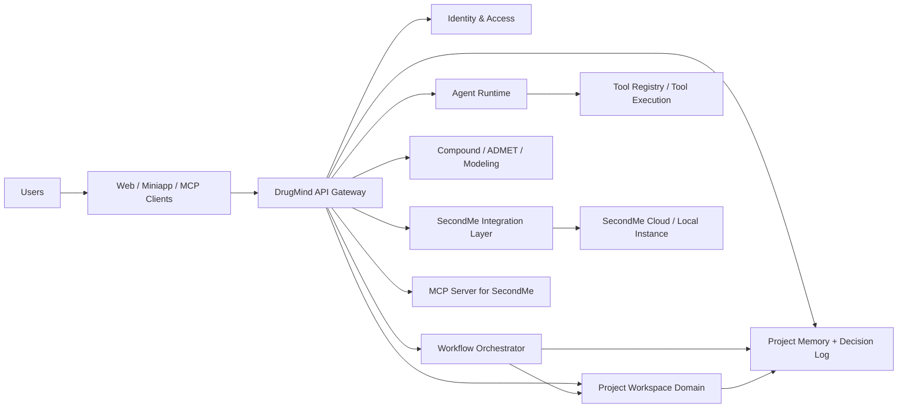
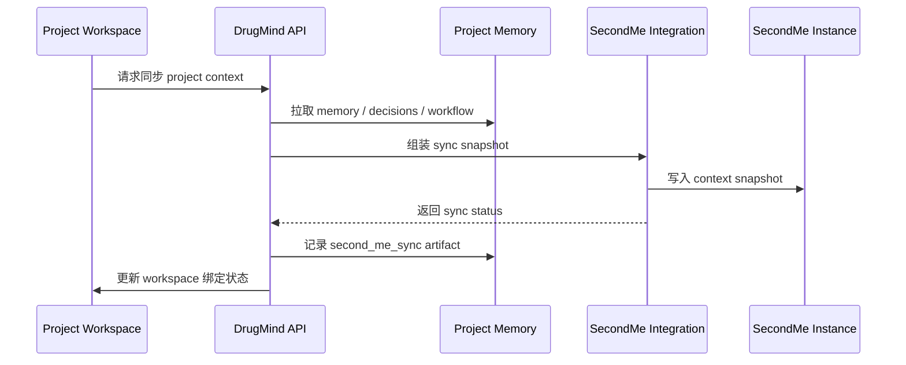

# DrugMind 架构蓝图

## 1. 架构目标

DrugMind 不应该只是一个“带几个 AI 角色的问答站点”，而应该被架构成一个面向药物研发团队的多智能体执行平台。  
平台的核心目标有 5 个：

1. 把“讨论”升级成“可追踪的项目执行对象”。
2. 把“AI 角色”升级成“有身份、技能、工具、记忆、工作流权限的 agent”。
3. 把“SecondMe”从外部接入点升级成“用户级数字身份与项目上下文同步层”。
4. 把“化合物、决策、讨论、项目记忆”收敛到同一个项目工作区模型。
5. 让平台具备从 demo 走向可运营产品的能力，包括多租户、审计、权限、部署、观测和商业化接口。

---

## 2. 平台定位

DrugMind 的正确定位不是单点 AI 工具，而是：

`药物研发多智能体协作操作系统`

它需要同时服务 4 类对象：

1. 用户：科学家、创业者、项目经理、外部顾问。
2. 数字分身：DrugMind 内部领域 agent，以及用户自己的 SecondMe persona。
3. 项目：围绕靶点、疾病、化合物系列和实验策略组织的执行单元。
4. 工作流：把项目推进从“聊天”转为“带状态的协作任务流”。

---

## 3. 当前仓库中的核心模块

当前代码已经具备可继续扩展的平台骨架，主要模块如下：

- API 入口：[api/api.py](/Users/apple/Desktop/DrugMind/api/api.py)
- MCP 接入层：[api/mcp_server.py](/Users/apple/Desktop/DrugMind/api/mcp_server.py)
- 数字分身引擎：[digital_twin/engine.py](/Users/apple/Desktop/DrugMind/digital_twin/engine.py)
- 讨论引擎：[collaboration/discussion.py](/Users/apple/Desktop/DrugMind/collaboration/discussion.py)
- 决策日志：[collaboration/decision_log.py](/Users/apple/Desktop/DrugMind/collaboration/decision_log.py)
- 项目与工作区：[project/kanban.py](/Users/apple/Desktop/DrugMind/project/kanban.py), [project/workspace.py](/Users/apple/Desktop/DrugMind/project/workspace.py)
- 项目记忆：[memory/project_memory.py](/Users/apple/Desktop/DrugMind/memory/project_memory.py)
- Agent / Skill / Tool 注册：[agents/registry.py](/Users/apple/Desktop/DrugMind/agents/registry.py), [skills/registry.py](/Users/apple/Desktop/DrugMind/skills/registry.py), [tools/registry.py](/Users/apple/Desktop/DrugMind/tools/registry.py)
- 工作流编排：[workflows/orchestrator.py](/Users/apple/Desktop/DrugMind/workflows/orchestrator.py)
- SecondMe 集成：[second_me/integration.py](/Users/apple/Desktop/DrugMind/second_me/integration.py), [second_me/bindings.py](/Users/apple/Desktop/DrugMind/second_me/bindings.py)

---

## 4. 目标架构总览



这个架构应分成 7 层：

1. Experience Layer
2. Gateway Layer
3. Identity Layer
4. Collaboration Domain Layer
5. Agent & Workflow Layer
6. Knowledge & Memory Layer
7. External Integration Layer

---

## 5. Experience Layer

### 5.1 Web 前端

前端不应该只是展示页面，而应作为“项目工作台”存在，至少包含：

1. Home / Demo / Narrative
2. Discussion Workspace
3. Project Cockpit
4. Compound Pipeline
5. Decision Ledger
6. SecondMe Persona Center
7. Integration & MCP Console

### 5.2 WeChat Miniapp

小程序更适合作为轻客户端，重点提供：

1. 快速提问
2. 讨论摘要查看
3. 决策审批
4. 项目提醒
5. 个人数字分身管理入口

### 5.3 MCP Client Surface

MCP 不只是工具列表暴露层，而是外部平台的“远程执行入口”。

SecondMe、ChatGPT Apps、其他 agent 平台接入 DrugMind 时，应统一走：

- 工具发现
- 工具鉴权
- 工具调用
- 调用审计
- 配额控制

---

## 6. Gateway Layer

`api/api.py` 当前承担了所有入口职责。中长期应拆成以下边界：

1. `api/gateway.py`
   - 统一请求入口
   - request id / trace id 注入
   - 限流
   - 身份解析

2. `api/public_routes.py`
   - 首页、健康检查、只读公开内容

3. `api/project_routes.py`
   - 项目 / 工作区 / 讨论 / 决策 / 记忆

4. `api/agent_routes.py`
   - twins / agents / workflows / orchestration

5. `api/integration_routes.py`
   - MCP / SecondMe / 外部平台

这样拆分的原因是：

- API 复杂度会继续增长
- 不同路由的鉴权和审计策略不同
- 外部集成的 SLA、日志和错误处理与内部项目 API 不同

---

## 7. Identity Layer

### 7.1 当前状态

当前用户模型在 [auth/user.py](/Users/apple/Desktop/DrugMind/auth/user.py)，属于本地简单用户档案。

### 7.2 目标状态

身份层需要分成 4 个概念：

1. Platform User
2. Organization / Team
3. Project Membership
4. Persona Identity

建议的用户域模型：

```text
User
  - user_id
  - profile
  - auth_providers[]
  - teams[]
  - owned_projects[]
  - owned_personas[]

Team
  - team_id
  - name
  - members[]
  - billing_plan

ProjectMembership
  - project_id
  - user_id
  - role
  - permissions[]

Persona
  - persona_id
  - provider (drugmind | second_me)
  - owner_user_id
  - linked_project_ids[]
```

### 7.3 SecondMe 在身份层的位置

SecondMe 不应该只是“外部 API”。  
它在架构上应被定义成：

`External Persona Provider`

也就是：

- DrugMind 内部角色 agent 是平台 agent
- SecondMe persona 是用户拥有的外部 persona
- 二者都能进入同一项目工作区，但权限和能力边界不同

---

## 8. Collaboration Domain Layer

这是 DrugMind 的业务核心层，建议以“项目工作区”作为一级对象。

### 8.1 Project

项目是顶层业务实体，至少包含：

- 基础信息：名称、靶点、疾病、预算、状态、阶段
- 科学对象：化合物、实验包、假设、风险
- 执行对象：讨论、决策、workflow、milestone
- 外部对象：SecondMe personas、MCP sessions、外部文档

### 8.2 Project Workspace

工作区不是附属对象，而是平台的核心容器。  
当前模型在 [project/workspace.py](/Users/apple/Desktop/DrugMind/project/workspace.py)，已经具备：

- default agents
- enabled skills
- enabled tools
- linked workflows
- linked discussions
- linked decisions
- linked compounds
- linked second_me_instances

目标上，Project Workspace 还应继续承担：

1. 协作权限
2. 观察面板配置
3. 默认工作流模板
4. 审批策略
5. 外部集成状态

建议最终结构：

```text
ProjectWorkspace
  - project_id
  - owner_id
  - team_id
  - members[]
  - default_agents[]
  - enabled_skills[]
  - enabled_tools[]
  - linked_workflows[]
  - linked_discussions[]
  - linked_decisions[]
  - linked_compounds[]
  - linked_second_me_instances[]
  - integration_state{}
  - alert_rules[]
  - ui_preferences{}
```

### 8.3 Discussion

讨论对象应有两种形态：

1. Freeform Discussion
   - 类似论坛 / 公开讨论
2. Structured Deliberation
   - 与项目、workflow step、决策直接关联

长期要把 [collaboration/discussion.py](/Users/apple/Desktop/DrugMind/collaboration/discussion.py) 从“回合制输出器”升级成：

- 可引用证据
- 可引用化合物
- 可引用决策
- 可形成共识状态
- 可被 workflow 消费

### 8.4 Decision

决策日志在 [collaboration/decision_log.py](/Users/apple/Desktop/DrugMind/collaboration/decision_log.py)。

它应该被视为“受监管的业务对象”，因为药物研发决策本身就是价值沉淀。

决策必须包括：

- 议题
- 结论
- 理由
- 参与者
- 反对意见
- 附带条件
- 置信度
- 对应 workflow
- 对应 memory entry
- 审批状态

---

## 9. Agent & Workflow Layer

### 9.1 Agent 模型

DrugMind 的 agent 不应只是 role prompt。

一个完整的 agent 结构应是：

```text
Agent
  - identity
  - category
  - role
  - specialties[]
  - default_skills[]
  - allowed_tools[]
  - execution_mode
  - memory_scope
  - guardrails
```

当前 [agents/registry.py](/Users/apple/Desktop/DrugMind/agents/registry.py) 已经走在这条路上，但下一步应继续补：

1. `guardrails`
2. `max_tokens / reasoning_policy`
3. `requires_review`
4. `provider_preferences`
5. `cost_class`

### 9.2 Skill Registry

Skill 不只是“描述能力”，还应承担：

- 输入契约
- 输出契约
- 适用场景
- 风险等级
- 依赖工具

### 9.3 Tool Registry

工具已经有 [tools/registry.py](/Users/apple/Desktop/DrugMind/tools/registry.py)。

目标上，Tool Registry 需要补：

1. tool health
2. version
3. latency profile
4. auth requirement
5. audit category
6. rate limit policy

### 9.4 Workflow Orchestrator

[workflows/orchestrator.py](/Users/apple/Desktop/DrugMind/workflows/orchestrator.py) 目前是轻量编排器。  
它的正确目标不是“记录 step 状态”，而是：

`Durable Project Execution Engine`

它最终要负责：

1. 模板化任务流启动
2. Step 分派
3. 上下文装载
4. 工具执行
5. Artifact 回写
6. 失败重试
7. 审批阻塞
8. 事件广播

建议未来增强字段：

```text
WorkflowRun
  - run_id
  - template_id
  - project_id
  - topic
  - context
  - execution_context
  - status
  - current_step_index
  - approvals[]
  - event_log[]
  - artifacts[]
  - metrics{}
```

### 9.5 推荐的内置 workflow

平台最少应该内置这几类：

1. Target Evaluation Workflow
2. Lead Optimization Workflow
3. Go / No-Go Decision Workflow
4. Meeting Preparation Workflow
5. Competitive Intelligence Workflow
6. SecondMe Enablement Workflow

这次代码中已经补入了 `workflow.second_me_enablement`，它应成为“把外部 persona 拉进项目执行流”的标准模板。

---

## 10. Knowledge & Memory Layer

### 10.1 Project Memory

项目记忆在 [memory/project_memory.py](/Users/apple/Desktop/DrugMind/memory/project_memory.py)。

目标上，Project Memory 应成为平台的检索与上下文总线，而不仅是笔记列表。

建议的 memory 类型：

- project_brief
- evidence
- discussion
- decision
- workflow
- workflow_step
- compound
- second_me_binding
- second_me_sync
- review
- risk
- competitor

### 10.2 Twin Memory

[digital_twin/memory.py](/Users/apple/Desktop/DrugMind/digital_twin/memory.py) 当前偏个人分身视角。

中长期需要区分 3 类记忆：

1. Persona Memory
2. Project Memory
3. Organization Memory

不同 agent 在不同场景下读取不同层级。

### 10.3 Retrieval Strategy

上下文拼装建议按优先级走：

1. 当前 workflow step
2. 项目近期决策
3. 当前主题相关的 project memory
4. 当前 agent persona memory
5. 外部 SecondMe snapshot

---

## 11. Compound & Scientific Tool Layer

DrugMind 在药研领域的壁垒不在于“也能聊天”，而在于：

`结构化项目推进 + 药研专有工具`

建议工具域拆成：

1. Compound Registry
2. ADMET Evaluator
3. SAR Notebook
4. Assay / Experiment Tracker
5. Decision Dashboard
6. Scenario Checklist Engine

当前仓库已有：

- [drug_modeling/compound_tracker.py](/Users/apple/Desktop/DrugMind/drug_modeling/compound_tracker.py)
- [drug_modeling/admet_bridge.py](/Users/apple/Desktop/DrugMind/drug_modeling/admet_bridge.py)

下一步需要补：

1. compound series
2. assay result model
3. structure-to-decision trace
4. experiment recommendation objects

---

## 12. SecondMe Integration Architecture

这是 DrugMind 和一般 AI 协作工具最大的差异点。

### 12.1 正确定位

SecondMe 不是“另一个聊天模型”，而是：

`用户级 persona / identity / memory provider`

DrugMind 则是：

`项目级协作 / orchestration / domain execution provider`

二者分工如下：

| 层 | SecondMe | DrugMind |
|---|---|---|
| Persona | 强 | 中 |
| 药研角色 | 弱 | 强 |
| 项目协作 | 弱 | 强 |
| 工作流执行 | 弱 | 强 |
| 用户个性一致性 | 强 | 中 |
| 决策沉淀 | 中 | 强 |

### 12.2 当前代码落点

本轮已经把 SecondMe 变成两层对象：

1. 实例层：[second_me/integration.py](/Users/apple/Desktop/DrugMind/second_me/integration.py)
2. 绑定层：[second_me/bindings.py](/Users/apple/Desktop/DrugMind/second_me/bindings.py)

### 12.3 SecondMe 实例层

实例层负责：

- 创建 persona
- 与 persona 对话
- 导出 SecondMe 格式
- 获取分享链接
- 接收项目上下文同步
- 本地持久化实例与对话历史

### 12.4 SecondMe 绑定层

绑定层负责：

- 记录 instance 与 user 的关系
- 记录 instance 与 project 的关系
- 记录 instance 与 DrugMind twin 的关系
- 保存最后一次 sync 状态
- 保存导出快照与关联 artifacts

### 12.5 推荐的同步链路



### 12.6 为什么必须有绑定层

如果没有绑定层，系统会出现 4 个问题：

1. 无法知道哪个项目已经接入了哪个 persona
2. 无法知道同步是否过期
3. 无法将 workflow 与 persona 联动
4. 无法对外展示“这个项目的 SecondMe 面板”

---

## 13. Data Storage 设计

当前仓库是文件式 JSON 存储，这对原型阶段是合理的。  
但要清楚下一步演进路径。

### 13.1 原型阶段

适合现在的存储：

- 用户量低
- 单机部署
- 便于 debug
- 易于导出快照

### 13.2 成长期

建议迁移到：

- PostgreSQL：主业务数据
- Redis：缓存 / session / 队列
- Object Storage：导出文件、媒体、文档、实验包
- Vector Store：长文本检索与证据召回

### 13.3 关系型目标模型

建议核心表：

- users
- teams
- projects
- project_memberships
- project_workspaces
- agents
- workflows
- workflow_steps
- decisions
- project_memory_entries
- compounds
- compound_series
- discussions
- discussion_messages
- second_me_instances
- second_me_bindings
- integration_audit_logs

---

## 14. Deployment Topology

### 14.1 当前可行拓扑

```text
Frontend (GitHub Pages / static)
          |
          v
API Server (FastAPI on Tencent Cloud)
          |
          +--> MIMO / LLM provider
          +--> RDKit / scientific tools
          +--> SecondMe cloud or local instance
```

### 14.2 推荐正式拓扑

```text
CDN / Edge
  -> Web frontend
  -> API Gateway
      -> Auth Service
      -> DrugMind Core API
      -> Workflow Worker
      -> Retrieval / Memory Service
      -> Scientific Compute Worker
      -> Integration Worker (SecondMe / MCP / OAuth)

Data:
  -> Postgres
  -> Redis
  -> Object Storage
  -> Observability Stack
```

### 14.3 为什么要拆 Worker

药研平台里有很多长任务：

- 多 agent 讨论
- compound 批量评估
- 文献抓取
- 数据整理
- SecondMe 上下文同步
- 导出报告 / deck / brief

这些任务不应该都塞在同步 API 请求里。

---

## 15. Security & Governance

这是药研平台必须尽早设计的部分。

至少要有：

1. 用户鉴权
2. 项目级权限控制
3. persona 访问控制
4. 工具调用审计
5. 外部集成调用日志
6. 敏感数据脱敏
7. 导出水印 / 导出审计

SecondMe 相关尤其要控制：

- 谁能创建 persona
- 谁能绑定 persona 到项目
- 谁能同步项目上下文到 persona
- 谁能拿到分享链接

---

## 16. Observability

当前原型缺乏完整观测。正式产品需要至少 4 类指标：

1. Product metrics
   - 日活、项目数、讨论数、决策数、workflow 完成率

2. Agent metrics
   - agent 调用次数、平均 latency、平均 token、失败率

3. Workflow metrics
   - template 启动次数、step 停滞率、完成率

4. Integration metrics
   - MCP 工具调用次数
   - SecondMe sync 成功率
   - 外部 persona 活跃度

---

## 17. 推荐的演进顺序

### Phase 1：平台骨架成型

目标：

- 项目 / 工作区 / 记忆 / 决策 / workflow / second_me binding 全部具备 durable object 能力

当前仓库已经接近这个阶段。

### Phase 2：执行引擎成型

要补：

1. workflow step 真执行
2. agent output artifact
3. 审批 / review gate
4. 异步任务队列

### Phase 3：产品面成型

要补：

1. Project Cockpit
2. Decision Ledger UI
3. SecondMe Persona Center
4. Workflow Timeline

### Phase 4：商业化与多租户

要补：

1. team / workspace billing
2. quota
3. private project controls
4. export & compliance

---

## 18. 我对 DrugMind 的最终判断

DrugMind 最有机会成为的，不是“另一个药研聊天机器人”，而是：

`以项目工作区为核心、以多 agent 工作流为驱动、以 SecondMe 作为用户人格与记忆扩展层的药物研发协作平台。`

真正的产品壁垒来自三件事：

1. 项目上下文的持续积累
2. 决策与执行的结构化沉淀
3. 用户 persona 与专业 agent 的协同运行

只要围绕这三件事继续收敛，DrugMind 的上限就不是一个工具，而是一套药研协作基础设施。
